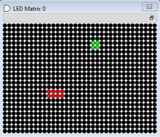

# Arquitectura Práctica 2

🍧 🎀 𝒮𝓃𝒶𝓀𝑒 🎀 🍧

El objetivo de esta práctica es medir el impacto en performance de diferentes configuraciones de memorias cache. Para realizar la medición de performance se realizará la implementación del Juego Snake en lenguaje C utilizando el simulador RIPES. Como pantalla de visualización se utilizará la matriz de leds y como control de entrada el D-Pad.

  

  

